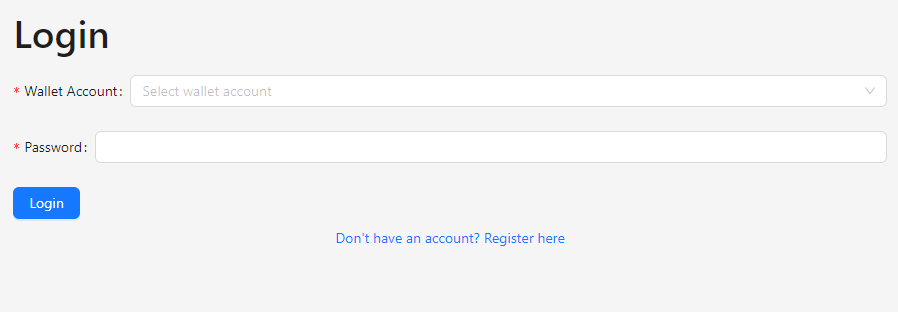

# CreditHub

A dapp pre-loaded with banking and loaning features

## Deployment
- First clone the repository
  ```
  git clone https://github.com/dingavinga1/credithub
  ```

- Install `ganache-cli` and `truffle`
  ```
  npm install -g ganache-cli
  npm install -g truffle
  ```

- Run `ganache-cli`
  ```
  ganache-cli
  ```

- Download [Metamask](https://chromewebstore.google.com/detail/metamask/nkbihfbeogaeaoehlefnkodbefgpgknn) extension for Chrome and set it up
- Import test accounts into Metamask by copying private keys of each wallet from the `ganache-cli` console

- Compile and deploy the contract to Ganache
  ```
  cd truffle
  npm install
  truffle migrate
  ```

- Start the web server
  ```
  cd client
  npm install
  npm start
  ```

- Go to `localhost:8080` and enjoy!

## Screens

### Authentication

#### Register
> Here, a user can register themselves to the smart contract by providing a password and their monthly income


#### Login 
> Here, a user can log into the application by providing their password



### Banking 

#### Deposit
> Depositing to the bank. The transaction is completed via Metamask


#### Withdraw
> Withdrawing from the bank to your wallet


#### Loaning 
> Viewing loan status, repaying and requesting loans


#### Profile
> Viewing loan status and account balance


### Admin
> Here, the bank owner can invest in the bank and view total amount available within the bank


## Solidity Code Review

### Constructor
The constructor is made payable to receive an initial funding of 50 ethers in the bank to get it up and running. This initial funding is required to start the bank.

### Receive
The default receive method is made payable to accept additional funding from anonymous users.

### Modifiers

#### isOwner
This modifier is added to owner functions to verify the role of admin/owner.

#### isAccountOwner
This modifier is added to normal bank users to ensure they are registered with the account.

#### canGetLoan
This modifier is added to the request loan method to ensure:
- The user has been a part of the bank for atleast 10 seconds (should be greater in real life)
- The user does not have an already existing loan with the bank


### Owner Methods

#### invest 
The owner can invest into the bank using this function.

#### getBankFunds
The owner can view the total funds available in the bank using this function.


### User Methods

#### register
Users can register themselves with the bank by giving an initial fee of 1 ether using this function.

#### deposit
Users can deposit money into their accounts using this function.

#### withdraw
Users can withdraw money into their wallets using this function by providing their password

#### getUserBalance
Users can get their bank balance using this function.

#### getLoan
Users can request a loan from the bank using this function, provided that the loan amount is up to 50 ethers.

#### getLoanStatus
Users can get the amount to be paid and time of loan request using this function.

#### returnLoan
Users can return their loan using this function provided that they have enough balance in their account.


